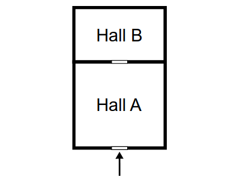

# A Museum Problem - Multithreading approach
This is a solution I implemented as a final project for Operating Systems with Conccurency Programing course.
## Introduction
The idea of the program is to solve the following problem:

Imagine a small museum with just 2 halls: A and B. While visiting the museum you
enter  hall A, and you can reach hall B by passing through hall A. The situation is
depicted in the following figure:

    

People visiting the museum enter hall A, watch the exhibition, and decide whether
they want to continue by proceeding to hall B. Some people leave the museum immediately, 
others enter hall B, watch the second exhibition, and then return to
hall A, and finally leave. For safety reasons there must be no more than $`N_A`$ people in
hall A at the same time, and no more than $`N_B`$ people in hall B $`(N_B < N_A)`$. Write a
program(s) implementing synchronization algorithm that will allow:

1. visiting the museum at the same time by as many people as possible,
2. leaving the museum by people visiting hall B in the shortest possible time

## Implementation
Multithreading approach with the use of conditional variables was used in the solution. There are two mutexes - one for each global variable which store number of free slots in each hall. There are three conditional variables to enforce priority of visitors leaving hall B over new vistors.

## Compiling
Make sure to compile with `cc -lpthread main.c`